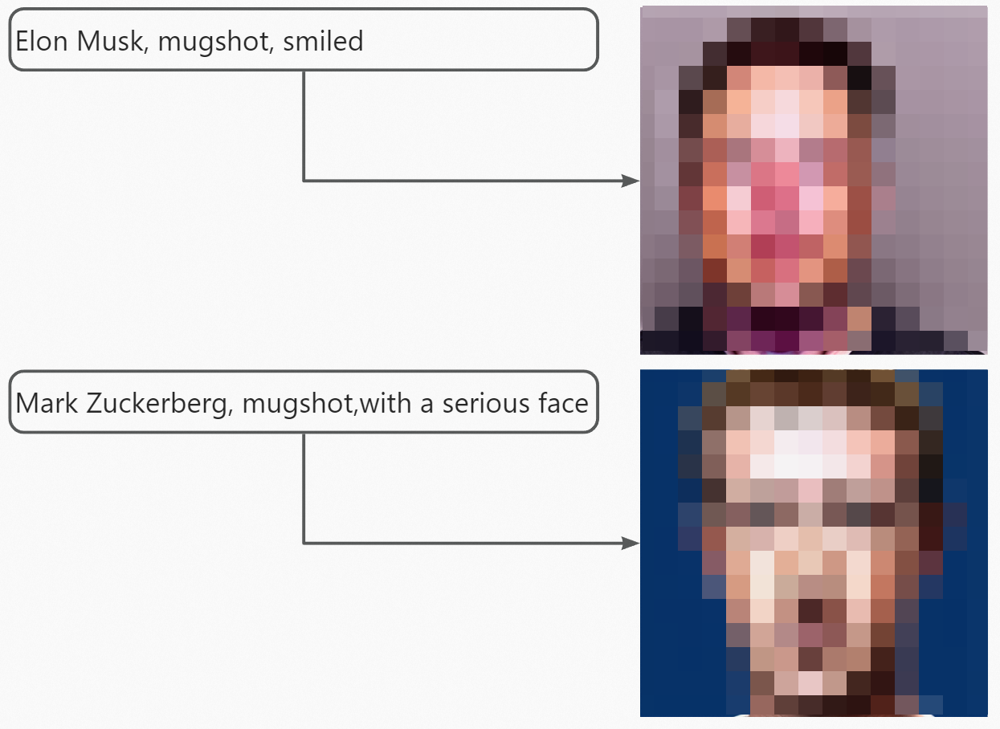
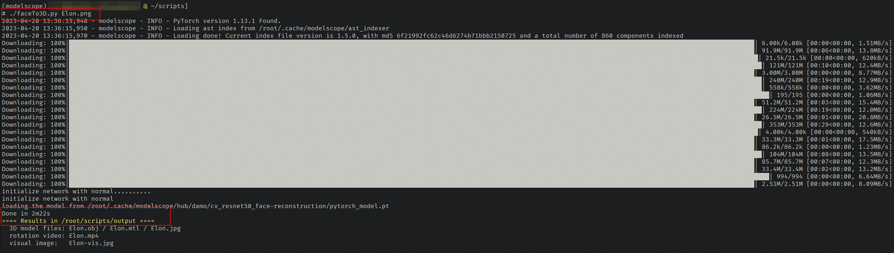
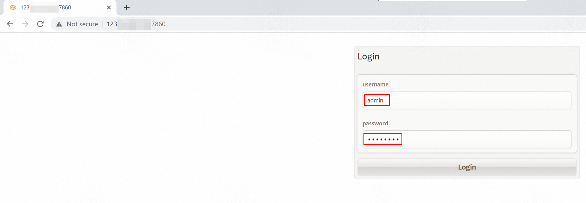
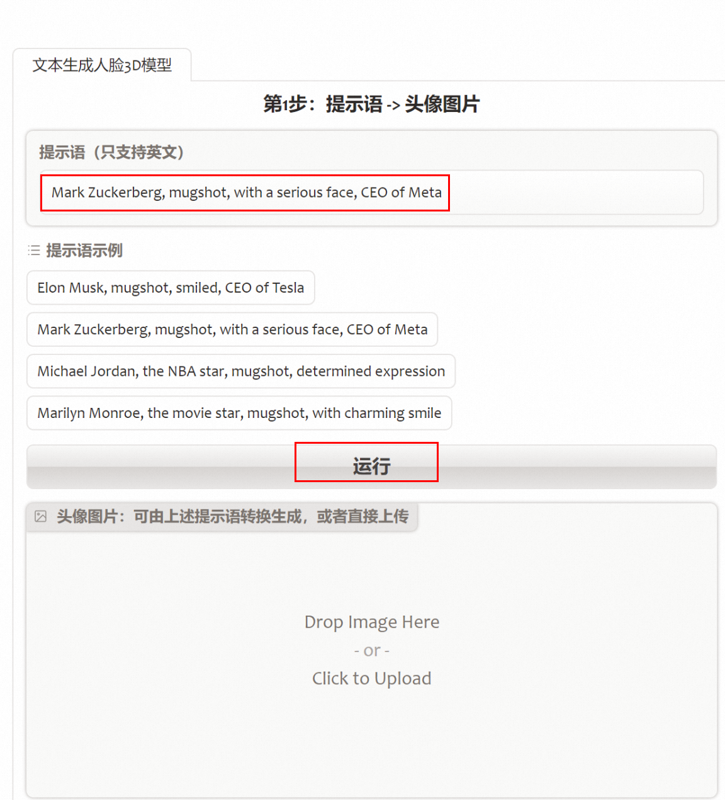
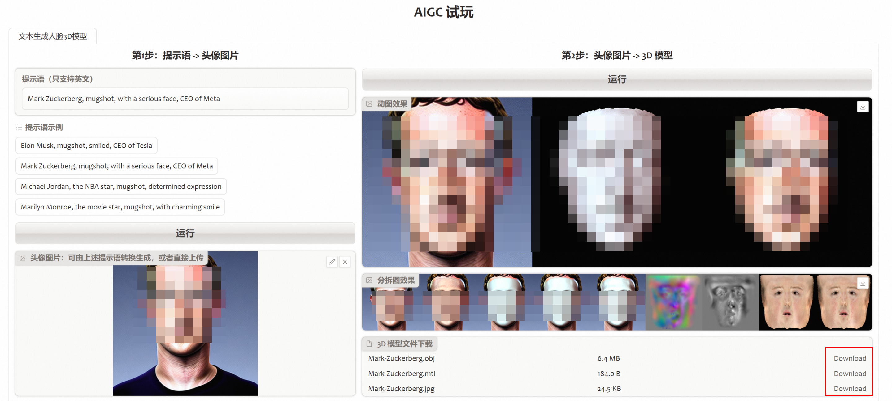

# AIGC多模态：文本生成3D模型与视频

>**免责声明：**本服务由第三方提供，我们尽力确保其安全性、准确性和可靠性，但无法保证其完全免于故障、中断、错误或攻击。因此，本公司在此声明：对于本服务的内容、准确性、完整性、可靠性、适用性以及及时性不作任何陈述、保证或承诺，不对您使用本服务所产生的任何直接或间接的损失或损害承担任何责任；对于您通过本服务访问的第三方网站、应用程序、产品和服务，不对其内容、准确性、完整性、可靠性、适用性以及及时性承担任何责任，您应自行承担使用后果产生的风险和责任；对于因您使用本服务而产生的任何损失、损害，包括但不限于直接损失、间接损失、利润损失、商誉损失、数据损失或其他经济损失，不承担任何责任，即使本公司事先已被告知可能存在此类损失或损害的可能性；我们保留不时修改本声明的权利，因此请您在使用本服务前定期检查本声明。如果您对本声明或本服务存在任何问题或疑问，请联系我们。

## 前言

> 须知**参差多态**，乃是幸福的本源。 —— 罗素

        想起这句话，是因为近日[震撼发布的 GPT-4](https://openai.com/research/gpt-4)，核心就是多模态 (multimodal)。是的，这句话大概可以演化为：**多模态**，乃是 AIGC（AI 生成内容）繁荣的本源。
        多模态是指 AIGC 的输入/输出形态，从单一的文字文本，演化到更丰富的图片、视频、音频等等，从而大幅拓宽其能力边界，拓展其应用场景。短短几个月，多模态正在爆发着蓬勃活力，Stable Diffusion、DALL.E、Midjourney……，继 “人人都能拍短视频”的 UGC（用户生成内容）时代之后，AIGC 时代正扑面而来。
        本文基于 [ModelScope](https://modelscope.cn/) 与业界流行的文生图框架 StableDiffusion，展示怎样用文本生成 3D 模型、用文本生成视频。在快速感知 AIGC 之余，希望这两个简单示例能激发起我们对 AIGC 的兴趣与热情 :)

## 1. 准备工作

创建 GPU 实例，步骤参考[这里](https://aliyuque.antfin.com/lhr9kq/zcta0f/lc0grwqig23feyr7?singleDoc#EO1dq)
**注意**：请使用本次 AIGC 推广活动配套的 AIGC 推理镜像

## 2. 文本生成 3D 模型

### a. 用 SD 来生成头像图片

1. StableDiffusion 环境搭建，步骤参考[这里](https://aliyuque.antfin.com/lhr9kq/zcta0f/lc0grwqig23feyr7?singleDoc#DUtou)
2. 通过简单的提示语，生成头像，例如

### b. 用头像图片生成 3D 模型

1. ssh 登入创建好的 GPU 实例，切换 conda 环境到 modelscope 中，运行
`conda activate modelscope`

2. 进入 scripts 目录，拷入前续步骤中生成的头像图片，运行脚本

   ```cd /root/scripts```

   ```./faceTo3D.py Elon.png```

   **注意**：脚本初次运行时，会通过公网自动下载所需的模型库，100M 带宽下载时间约为两分钟

3. 生成文件会放置在 output 目录，其中：

   3D 模型文件（.obj/.mtl/.jpg）可导入 Unity、UE 等软件中使用 头像旋转视频（rotation video）、可视化图片（visual image）用于快速浏览生成效果

4. 此步骤所使用的模型，详细信息请参考：[ModelScope - 人脸重建模型](https://modelscope.cn/models/damo/cv_resnet50_face-reconstruction)

### c. 对应的计算巢服务

> 上述步骤 2.b & 2.c，已经整合为计算巢服务，通过 web 页来方便用户使用

1. 登入[阿里云计算巢](https://computenest.console.aliyun.com/user/cn-hangzhou/recommendService)控制台，搜索 AIGC，点击*
   *正式创建**


2. 填写部署参数后，点击**立即创建**后，转入**去列表查看**

   | **参数组** | **参数项** | **示例** | **说明** |
   | --- | --- | --- | --- |
   | **地域** |
   | 北京 | 目前仅在北京地区开通服务，其它地区陆续增加中 |
   | **服务须知** | 请阅读后确认同意 |
   | 开通服务前，请务必仔细阅读，然后点击同意 |
   | **费用相关** | 付费模式 | 按量 |
   |
   | | 公网带宽 | 100 |
   |
   | | 流量付费类型 | 按使用流量 |
   |
   | **服务配置** | 实例规格 | ecs.gn7r-c16g1.4xlarge | 目前仅支持一个规格，其它规格陆续增加中 |
   | | 系统盘类型 | cloud_essd |
   |
   | | 系统盘大小 | 200 |
   |
   | | 实例密码 | ******** |
   |
   | | VPC ID | vpc-xxx |
   |
   | | 可用区 | 可用区 H | 若可用区为空, 可能是无库存 |
   | | 交换机 ID | vsw-xxx |
   |

3. 等待3~5分钟，实例状态由**部署中**变为**已部署**后，点击实例 id
   进入实例的管理页
4. 在**概览**标签页中，点击 AigcHost 对应的链接，访问对应的 web
   页
5. 首次访问时，填写用户名密码后登入。**用户名**为 admin，**密码**为步骤 2 中填写的**实例密码**


6. 手动输入**提示语**，或直接点击某条**提示语示例**，然后**运行，**来生成头像图片，耗时 ~1 分钟


7. 图片生成后（或者手动上传头像图片后），点击右上方**运行**按钮，生成 3D 模型，耗时 ~1 分钟，您可查看动图、分拆图效果，相关 3D 模型文件也可通过 Download 按钮下载


## 3. 文本生成视频

1. 与 2.b 步骤 1 相同：ssh 登入创建好的 GPU 实例，切换 conda 环境到 modelscope 中，运行
`conda activate modelscope`

2. 运行预置的脚本

   ```cd /root/scripts```

   ```./text2video.py```

   提示时输入文本，例如：Clown fish swimming through the coral reef.
**注意**：脚本初次运行时，会通过公网自动下载所需模型库，100M 带宽下载时间~
20分钟（此模型较大）

3. 生成文件 text2video.mp4 会放置在 output 目录，效果类似下图

   

4.此步骤所使用的模型，详细信息请参考：[ModelScope - 文本生成视频大模型](https://modelscope.cn/models/damo/text-to-video-synthesis/summary)
